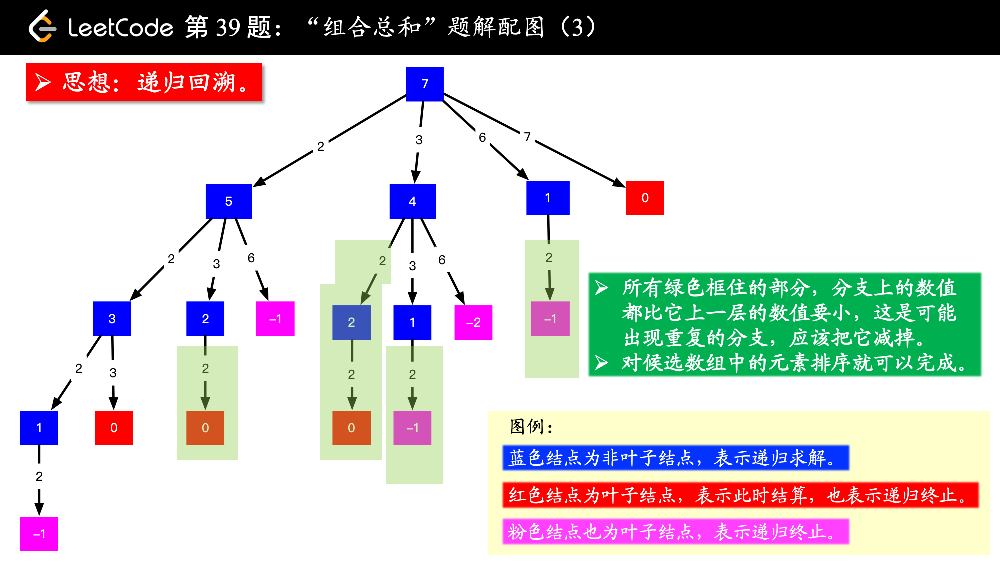

# leetcode39-组合总和

给定一个无重复元素的数组 candidates 和一个目标数target ，找出 candidates 中所有可以使数字和为 target 的组合。

candidates 中的数字可以无限制重复被选取。

**说明**：

所有数字（包括 target）都是正整数。
解集不能包含重复的组合。 
**示例** 1:
```
输入: candidates = [2,3,6,7], target = 7,
所求解集为:
[
  [7],
  [2,2,3]
]
```
**示例** 2:
```
输入: candidates = [2,3,5], target = 8,
所求解集为:
[
  [2,2,2,2],
  [2,3,3],
  [3,5]
]
```

### 题解

使用回溯法+DFS搜索，对于已经搜索过的进行剪枝

（图片来源：作者：liweiwei1419  [链接](https://leetcode-cn.com/problems/combination-sum/solution/hui-su-suan-fa-jian-zhi-python-dai-ma-java-dai-m-2/)   来源：力扣）

``` Python
class Solution:
    def combinationSum(self, candidates: List[int], target: int) -> List[List[int]]:
        n=len(candidates)
        if n==0: return []
        res =[]
        path=[]
        candidates.sort()
        self.dfs(candidates,0,n,target, res,path)
        return res

    def dfs(self, candidates,i,n,target,res,path):
        if target==0:
            res.append(path[:])
        for j in range(i,n):
            if target<candidates[j]: break
            path.append(candidates[j])
            # print(path,target,candidates[j])
            self.dfs(candidates,j,n,target-candidates[j],res,path)
            path.pop()
```